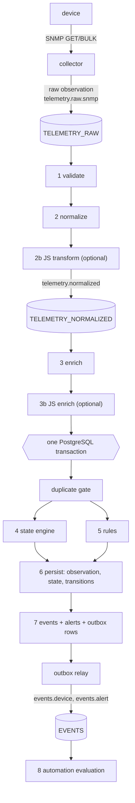

# Processing pipeline



## Stage responsibilities

| # | Stage | Input → output | Reads | Notes |
|---|---|---|---|---|
| 1 | validation | bytes → `Observation` | limits | strict JSON (unknown fields, trailing data, oversize rejected); structural checks; no maximum age so replays stay valid; timestamps ≤ 5 min in the future |
| 2 | normalization | raw → canonical | `configs/normalization.yaml` | rename, scale, enum→bool, label mapping; unmapped metrics pass through (the hook for scripts); pure function of message + table, so the normalized stream is regenerable from raw |
| 2b | JS transform | canonical → canonical or drop | script | may change metric/value/labels/metadata; may **not** change `observation_id`, `correlation_id`, `device_id`, `source`, `observed_at`, `received_at`; must declare `meta.metrics`; result is decoded strictly and re-validated |
| 3 | enrichment | + device context in `metadata` | inventory | hostname, type, site, vendor, model, tags, interface description; labels are never touched (labels identify a series, metadata describes it) |
| 3b | JS enrich | metadata additions | script + device view | may change only `metadata` |
| 4 | state | observation → state, transitions, events | `configs/states.yaml`, `state_current` | see below |
| 5 | rules | series window → activation events | `configs/rules.yaml`, stored samples | see below |
| 6 | persistence | everything in one transaction | | duplicate gate first |
| 7 | events | transitions → events → alerts → outbox | | events only on meaningful transitions |
| 8 | automation | alert events → requests | policies | separate process; see AUTOMATION.md |

## Message schemas

Versioned JSON, version in the `X-Schema` header (`observation.v1`, `event.v1`, `inventory.v1`, `automation.request.v1`, `automation.result.v1`, `deadletter.v1`). The observation schema is documented as JSON Schema in [docs/schemas/observation.v1.json](docs/schemas/observation.v1.json) and a test fails if it drifts from the Go struct.

```json
{
  "observation_id": "9f2c…",   "correlation_id": "0b7d…",   "device_id": "switch-01",
  "source": "snmp",            "metric": "network.interface.operational",
  "value": false,              "labels": {"interface": "Gi0/1", "if_index": "1"},
  "observed_at": "2026-08-01T22:14:07Z", "received_at": "2026-08-01T22:14:07.4Z",
  "metadata": {"raw_metric": "snmp.ifOperStatus", "site": "lab"}
}
```

`observation_id` is deterministic per measurement (collection cycle + device + metric + labels): the same message redelivered has the same ID, a new poll a new one. `correlation_id` is minted once per collection cycle and follows every derived artefact: observation → event → automation request → result. Headers carry `X-Correlation-Id` so a message can be traced in the stream without decoding it.

## NATS subjects and streams

| Subject | Stream | Retention | Purpose |
|---|---|---|---|
| `telemetry.raw.snmp`, `telemetry.raw.script` | `TELEMETRY_RAW` | 2 d / 1 GiB | source-specific observations; replay after normalization changes |
| `telemetry.normalized` | `TELEMETRY_NORMALIZED` | 2 d / 1 GiB | canonical observations; replay/rebuild point |
| `inventory.observed` | `INVENTORY` | 7 d | facts (sysName…) observed while polling |
| `events.device`, `events.alert` | `EVENTS` | 30 d | every event / alert lifecycle only |
| `automation.request`, `automation.result` | `AUTOMATION` | 30 d | audit stream |
| `system.deadletter` | `DEADLETTER` | 14 d | messages that could not be processed |
| `sim.control` | none (core NATS) | – | scenario commands; not worth replaying |

JetStream is used only where durability, replay or a visible backlog pays for itself.

## Delivery semantics

- **At-least-once, stated plainly.** A message is acknowledged only after its handler returns nil. Crash mid-handler ⇒ redelivery.
- **Where duplicates are accepted and why they are safe:**
  - *consumer redelivery* → observation PK gate (stage B); stage A is a pure function whose output is de-duplicated by `Nats-Msg-Id`; event/alert/transition IDs are deterministic;
  - *publisher retry* → `Nats-Msg-Id` = observation ID (JetStream drops copies within a 2-minute window);
  - *outbox re-send after crash* → message IDs `eventID` and `eventID.alert` (distinct: both subjects share a stream, and JetStream de-duplicates per stream);
  - *automation* → request ID = hash(policy, event); exclusive claim; result insert is idempotent; adapters must be idempotent for the re-execution after a lease expiry.
  - *integrations* → `Idempotency-Key` header, stable per (script, event).
- **Consumer groups.** Consumers sharing a durable name split the work (one member per message); scale processors horizontally by starting more.
- **Ack strategy.** Explicit ack after success; `InProgress` heartbeats every `ack_wait/3` keep a slow handler from being redelivered; NAK with delay for retryable failures; `Term` after dead-lettering.
- **Retry.** Only transient/timeout/dependency errors, with exponential backoff (×2, ±20 % jitter, capped at 1 min), up to `max_deliver`.
- **Poison messages.** Validation, permanent, unsupported, authentication and script errors and handler panics are dead-lettered on the *first* failure. A dead-letter publish that fails leaves the message queued (NAK) instead of dropping it.
- **Abandoned final attempt.** If a worker dies during a message's last allowed delivery, JetStream stops redelivering silently. A watcher on the `MAX_DELIVERIES` advisory moves such messages to the dead-letter stream.
- **Ordering assumptions.** Per device within a shard; not across devices; not across redelivery. The state engine ignores samples older than the last applied one.

## Backpressure

When collection outruns processing:

1. Stage B handlers slow (database throughput) → shard buffers fill.
2. The worker's consume callback blocks; the client stops pulling (`PullMaxMessages` = worker capacity).
3. The backlog accumulates **in JetStream** — durable, bounded by `MaxAge`/`MaxBytes` (oldest discarded), and visible as `observation_queue_depth{consumer}`.
4. A saturated script executor rejects with `ErrSaturated` (retryable) after a bounded wait → the message is NAK'd with backoff → the same backpressure path. `javascript_saturations_total` shows it.
5. Memory stays bounded throughout; no goroutine is spawned per message.

Alert on queue depth growth, not on CPU.

## State engine

```
UP ──bad──▶ SUSPECT ──bad×fail_after (and fail_for)──▶ DOWN ──good──▶ RECOVERING ──good×recover_after (and recover_for)──▶ UP
             │ good                                      ▲                │ bad
             ▼                                           └────────────────┘  (no new alert: the old one is still open)
            UP
```

- `alert` fires on entering DOWN; `recovery` on returning to UP; SUSPECT and RECOVERING never produce events. That is the debounce.
- Numeric metrics use **hysteresis**: breach above 0.90, clear only below 0.80, so a value hovering at the line does not flap.
- **Stale data**: silence counts as a bad sample. The sweeper feeds synthetic samples with deterministic IDs per sweep bucket (two sweepers, or one sweeping twice, produce the same observation and the second is a duplicate). `LastSeenAt` (real samples only) drives staleness so synthetic samples cannot reset the clock.
- Entities are keyed by definition + device + declared key labels, so each interface has its own machine.
- **Why state machines and not alerts per sample:** one lost UDP packet would page someone; a flapping metric would storm; recovery would be indistinguishable from noise; and there would be no state to attach history, automation conditions ("still firing after 10 minutes") or cooldowns to.

Definitions are YAML (`configs/states.yaml`): metric, key labels, `good_when` or `threshold`, `fail_after`, `recover_after`, optional `fail_for`/`recover_for`, `stale`, and the alert/recovery events.

## Rules

Windowed conditions over a stored series: `transitions N within W` (flapping) or `average_over|max_over|min_over W` with `greater_than|less_than`. Evaluated in the same transaction from `observations` with `observed_at ≤ current`, so results are deterministic under replay and reordering. A rule fires once on activation and clears once; activation is tracked as state (`rule:<id>/…`). Fewer samples than `min_samples` is "no data", never a breach.

## Event generation

Events are produced only on transitions (state) or activations (rules). `interface.down` (state, 2 consecutive samples) and `interface.flapping` (rule, 5 transitions in 10 min) are different questions and both exist. Opening events open an alert (at most one firing alert per alert key, enforced by a partial unique index); recovery events resolve it.

## One event, end to end

`switch-01` port `Gi0/2` goes down (`make scenario DEVICE=switch-01 EVENT=interface-down ARGS="--arg interface=Gi0/2"`):

1. The **simulator** sets the port down; its UDP agent now answers `ifOperStatus.2 = 2`.
2. The **collector** poll (`corr=673a…`) walks `ifName` and `ifOperStatus`, emits `snmp.ifOperStatus` `{ifIndex:2, ifName:Gi0/2} = 2` and publishes it to `telemetry.raw.snmp` with `Nats-Msg-Id = observation_id` and `X-Correlation-Id`.
3. **Stage A** decodes and validates it, normalizes to `network.interface.operational = false` with labels `{interface:Gi0/2, if_index:2}`, records `raw_metric`; no transform script declares this metric, so JavaScript is not invoked. Published to `telemetry.normalized`.
4. **Stage B** enriches with hostname/site/vendor/tags/interface description; the `classify-interface` script adds `interface_role: ethernet`.
5. In one transaction: the observation insert succeeds (not a duplicate); `TouchDevice`; the `interface-operational` machine goes UP → SUSPECT (first bad sample, no event); the rule `switch-interface-flapping` sees < 5 transitions.
6. The next poll (10 s later) is a second consecutive bad sample: SUSPECT → DOWN. The engine emits `interface.down` (`warning`, deterministic `event_id`, same `correlation_id`), stores the transition, opens the alert, and enqueues two outbox rows (`events.device`, `events.alert`) — all in the same transaction.
7. The **relay** publishes both to `EVENTS`. The JavaScript **webhook integration** (in the automation worker) posts the event to the configured endpoint with an `Idempotency-Key`.
8. The **automation worker** matches policy `remediate-interface-down`; the script `interface-remediation` proposes `bounce_interface(Gi0/2)` (it declines uplinks); Go validates it against the catalog and the policy's `allowed_actions`, records a request due in 2 minutes (`correlation_id` unchanged).
9. Two minutes later, if the alert is still firing, the gates run (tag, capability, allowlist, maintenance window, cooldown, retry limit); the adapter performs a **dry-run**, which does a real SNMP read: *"dry-run: would bounce interface Gi0/2 on switch-01 (currently oper=down admin=up)"*. The result is persisted and published on `automation.result`.
10. `GET /api/automation` shows request and result; `GET /api/events` shows the event; the same `correlation_id` appears on all of them and on the raw message in `TELEMETRY_RAW`.

(This scenario, asserting each of those facts, is `internal/e2e` `TestEndToEndSwitchInterfaceDownToAuditedDryRun`.)

## Retry, dead letters, idempotency, replay

- **Dead letters** carry the original payload byte-for-byte, headers, error, category, reason (`poison` | `max_deliveries`), attempts and the stream position. `infra-observer deadletter list|replay|purge`.
- **Replay** republishes with a fresh message ID (the original may still be inside the de-duplication window). Handlers are idempotent, so replaying something that partly succeeded is safe. Replaying a stream window (`infra-observer replay --since 1h`) is bounded to the stream's last sequence at the moment it starts (it republishes into the stream it reads; an early version of this had a feedback loop, found by a test).
- **Rebuild** into an empty database: start fresh consumers (new durable names) and the retained streams are processed from the beginning; deterministic event IDs make the rebuilt history identical (`TestReplayRebuildsIdenticalStateInAnEmptyDatabase`).
