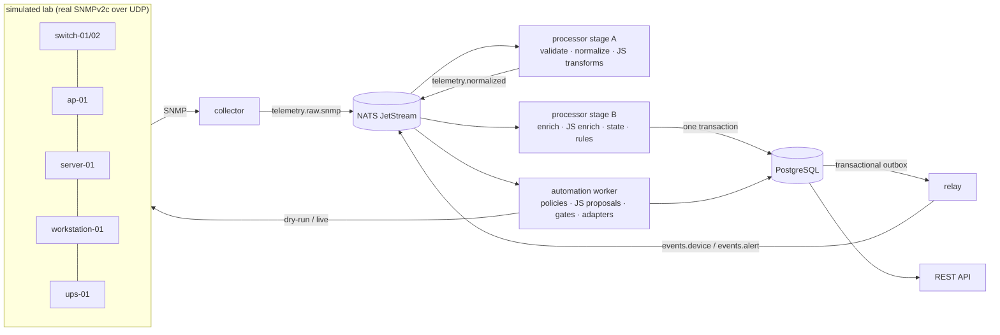

# infra-observer

`infra-observer` is a message-driven infrastructure monitoring and automation platform written in Go. It treats telemetry collection, normalization, state evaluation, alerting, automation, and extensibility as separate concerns so each can be tested, replayed, and reasoned about independently. Embedded JavaScript provides controlled runtime extensibility without requiring changes to the core binaries.

It is a clean-room portfolio project. Every device, hostname, OID subtree, configuration and script in this repository is synthetic or public.

## 1. What this project demonstrates

- **A real pipeline, not poll → database → graph.** Collectors emit observations; normalization, enrichment, state, rules, persistence, alerting and automation are separate stages with separate tests.
- **Honest messaging.** NATS JetStream with at-least-once delivery, idempotent consumers, bounded concurrency, backpressure, retry by error category, dead-lettering, and replay. Nothing pretends to be exactly-once.
- **State machines instead of sample-driven alerts.** One failed poll is an observation, not an outage.
- **Controlled extensibility.** Embedded JavaScript (goja) can transform, enrich, integrate and *propose* automation, but cannot execute anything: it has no filesystem, process, raw network or database access, and its output is re-validated by Go.
- **Automation with a safety story.** Closed action catalog, dry-run by default, cooldowns, allowlists, maintenance windows, approvals, an audit trail with correlation IDs.
- **Operational thinking.** Health/readiness/dependency endpoints, Prometheus metrics, deployment scripts with preflight validation and automatic rollback, systemd units, failure injection, and end-to-end tests that kill things on purpose.

## 2. Architecture overview



One binary, several roles: `collector`, `processor`, `automation-worker`, `api` (plus `simulator` and `webhook-sink` for the lab). See [ARCHITECTURE.md](ARCHITECTURE.md).

## 3. Why NATS

Collection and processing have different failure modes and rates. A durable queue between them means a slow database delays events instead of losing telemetry, lets consumers restart mid-message, and makes the backlog *visible* (`observation_queue_depth`). JetStream is used where durability or replay pays for itself (raw and normalized telemetry, events, automation, dead letters); the simulator control channel is plain core NATS. See [DECISIONS.md](DECISIONS.md) ADR 2–3.

## 4. Processing pipeline

`validate → normalize → (JS transform) → enrich → (JS enrich) → state → rules → persist → events/alerts → automation`. Each stage has one job and is individually testable. Full detail, message schemas and one complete event traced end to end: [PIPELINE.md](PIPELINE.md).

## 5. Embedded JavaScript extension model

Scripts live in `scripts/{transforms,enrichers,automation,integrations}/`, are configured separately from their source, run on a pool of isolated interpreters under a deadline, exchange only JSON with Go, and see a deliberately small host API. Broken scripts are skipped, counted and quarantined; they never take the process down. Examples are real (vendor CPU/temperature normalization, interface role classification, remediation proposal with judgment, webhook integration). See [SCRIPTING.md](SCRIPTING.md).

## 6. Supported telemetry

SNMPv2c/v3 collection driven by YAML profiles (`configs/profiles/`): system group, IF-MIB interfaces and counters, HOST-RESOURCES CPU, UPS-MIB, and vendor/private objects. Canonical metrics include `system.reachable`, `system.uptime`, `network.interface.operational`, `system.cpu.utilization`, `system.memory.utilization`, `environment.temperature.celsius`, `power.ups.on_battery`. Device types: switch, access point, router, server, workstation, printer, UPS, generic.

## 7. Device simulation

The simulator is a **real SNMPv2c agent per device over UDP**, not a fake injected into the collector, so simulated telemetry exercises the same code path as real telemetry. It adds baseline noise (including 2 % packet loss, which the state machine absorbs) and scenarios: interface flap/down, high CPU, overheating, power loss, offline, authentication failure.

## 8. Quick start

Requirements: Go 1.26, Docker (for the compose lab and PostgreSQL-backed tests), `make`.

```bash
make setup build test        # unit tests need no database
make run                     # NATS + PostgreSQL + platform + simulated lab
curl localhost:8080/api/devices
curl localhost:8080/api/events
make logs SERVICE=processor
make reset                   # stop and delete all data
```

Other targets: `make lint`, `make check` (lint + tests + script fixtures + deployment tests), `make integration-test` / `make e2e` (throwaway PostgreSQL in Docker), `make test-scripts`, `make bench`, `make package`.

## 9. Running scenarios

```bash
make scenario DEVICE=switch-01 EVENT=interface-flap
make scenario DEVICE=switch-01 EVENT=interface-down ARGS="--arg interface=Gi0/2"
make scenario DEVICE=server-01 EVENT=high-cpu
make scenario DEVICE=ap-01     EVENT=offline
make scenario DEVICE=ups-01    EVENT=power-loss
bin/infra-observer scenario --list
```

After a minute: `curl localhost:8080/api/events`, `curl 'localhost:8080/api/alerts?status=firing'`, `curl localhost:8080/api/automation`, `curl localhost:8090/v1/received` (the webhook integration's deliveries).

## 10. Automation safety

Automation is a separate subsystem: `event → policy → proposal → validation → gates → adapter → audited result`. Actions come from a closed, typed catalog (no shell, no free-form commands). Everything is **dry-run** unless *both* `automation.default_dry_run: false` *and* the policy says `dry_run: false`, and live mutation additionally requires an allowlisted device. Scripts may propose; only Go decides. See [AUTOMATION.md](AUTOMATION.md).

## 11. Failure handling

Retry only what can heal (transient, timeout, dependency); dead-letter the rest immediately; bound every retry; never lose a message when dead-lettering fails; keep the outbox so events survive a crash between commit and publish. Try it:

```bash
make fail COMPONENT=database        # then: make heal COMPONENT=database
make fail COMPONENT=nats MODE=kill
make inject KIND=malformed          # then: make dlq
make fault-script SCRIPT=spins      # a script that never returns
```

Expected behaviour for each is documented in [OPERATIONS.md](OPERATIONS.md#failure-scenarios).

## 12. Deployment

Docker Compose is provided for evaluation. For real hosts there are plain, inspectable scripts (`deployments/scripts/`): package, validate, deploy (checksum → preflight with the new binary → migrate → atomic symlink switch → restart → smoke test → automatic rollback), rollback, bootstrap, plus hardened systemd units (`deployments/systemd/`). No hosted CI and no Kubernetes are required or included. See [OPERATIONS.md](OPERATIONS.md).

## 13. Testing

| Layer | What | Needs |
|---|---|---|
| Unit | normalization, enrichment, state machine, rules, policy, gates, host API, script contracts, timeouts, config, schemas | nothing |
| Store contract | one suite run against the in-memory and PostgreSQL stores | Docker for PG |
| Integration | embedded JetStream, PostgreSQL, pipeline idempotency under concurrency | Docker for PG |
| Script fixtures | every shipped script against JSON fixtures (determinism, shape, errors, timeouts, HTTP mocks) | nothing |
| Deployment | package/deploy/rollback/refusal paths in a temp prefix | nothing |
| End-to-end | whole platform vs. real NATS, PostgreSQL and UDP SNMP agents: golden path, duplicates, crash mid-message, DB outage, NATS restart, poison input, replay rebuild, broken scripts, auth failure | Docker for PG |

## 14. Known limitations

- SNMP write operations are not implemented; mutating automation actions are carried out against the simulator through a controller interface. Read-only actions use real SNMP.
- SNMPv3 is implemented (credentials, levels, protocols) but only v2c is exercised against the simulator agent.
- No discovery beyond explicit registration and `auto` profile matching by `sysObjectID`.
- Script collectors (`collect(device, ctx)`) have a contract and host API (`http.request`, `metrics.emit`) but no scheduler integration yet.
- Replay rebuilds state from retained streams (2 days by default); re-evaluating history under *changed* state definitions needs a fresh database.
- No dependency suppression between states (an interface on a dead switch is not marked "unknown").
- The API is unauthenticated for reads (put an authenticating proxy in front); only approvals need a token.
- Benchmarks are local micro-benchmarks, not capacity claims.

## 15. Production considerations

Secrets from a real store (Vault, cloud KMS, systemd credentials) behind the `secrets.Resolver` interface; TLS for NATS and PostgreSQL; `MaxAge`/`MaxBytes` and observation retention sized to your rate; partitioning `observations` (or TimescaleDB) once volume warrants it; migrations kept backward compatible for rollback; alerting on `observation_queue_depth`, `messages_failed_total{outcome="dead_letter"}` and readiness. Details in [OPERATIONS.md](OPERATIONS.md).

## Documentation

[ARCHITECTURE.md](ARCHITECTURE.md) · [PIPELINE.md](PIPELINE.md) · [SCRIPTING.md](SCRIPTING.md) · [AUTOMATION.md](AUTOMATION.md) · [OPERATIONS.md](OPERATIONS.md) · [DECISIONS.md](DECISIONS.md) · [docs/BENCHMARKS.md](docs/BENCHMARKS.md) · [docs/schemas/](docs/schemas/)

## License

MIT
